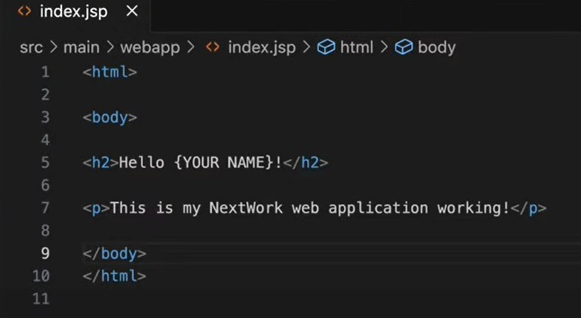
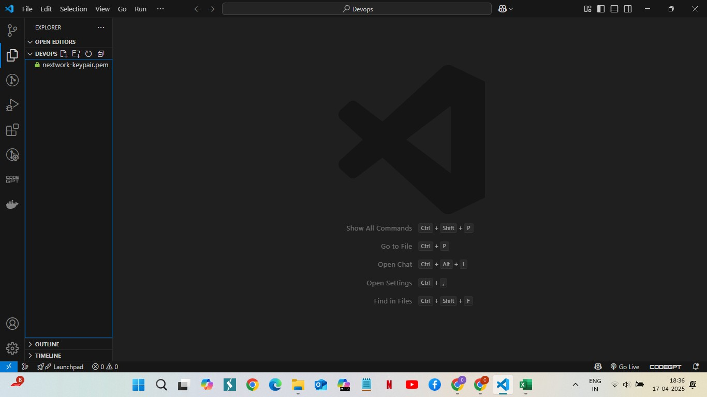
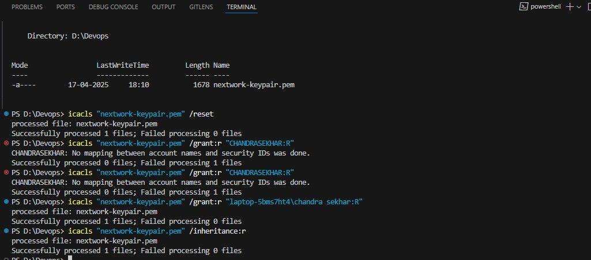
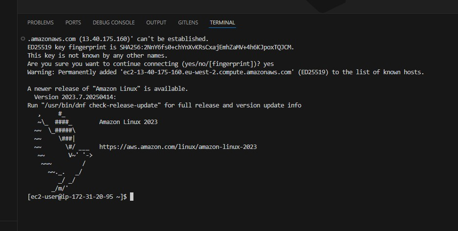
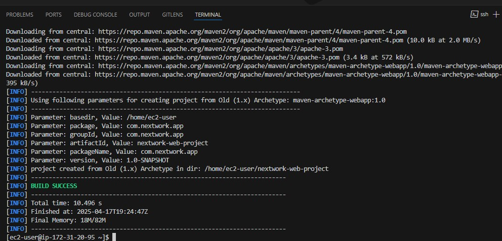
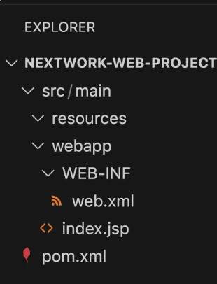

# 🚀 Set Up a Web App in the Cloud Using AWS & VS Code

**Author**: Vamshi Prasad Goteti
**Project by**: NextWork Student @ [NextWork.org](https://nextwork.org)

---

## 🔧 Key Tools and Concepts

- **Tools**: VS Code, Amazon EC2  
- **Concepts**: SSH connections, key pairs, cloud IDE, remote development

---

## 📸 Project Overview



Today, I set up a web app in the cloud using **AWS EC2** and **VS Code**. I learned to:
- Launch an EC2 instance  
- Connect using SSH  
- Edit web files both via IDE and terminal  
- Use Maven and Java for web development

---

## 🧠 Reflection


One surprise was the “secret mission” where we edited the file via terminal after the IDE. It was fun and insightful to experience both.

🕒 Time spent: ~2 hours (plus troubleshooting)  
🔑 Reward: Seeing SSH connection success!

---

## 🌐 Launching the EC2 Instance



EC2 instances are virtual cloud computers. I launched one to host my web app.

---

## 🔐 SSH & Key Pairs



SSH is a secure protocol to access remote servers. AWS gives us a **key pair**:
- **Public key** stays with AWS  
- **Private key** (e.g., `nextwork-keypair.pem`) is downloaded locally

We moved this `.pem` file into our `devops` folder.

---

## 🧑‍💻 VS Code Setup



VS Code helps us write and edit code easily. The **Remote-SSH extension** lets us connect directly to EC2 for remote editing.

---

## 💻 First Terminal Commands

```bash
icacls "nextwork-keypair.pem" /reset
icacls "nextwork-keypair.pem" /grant:r "USERNAME:R"
icacls "nextwork-keypair.pem" /inheritance:r
```

We used these to configure the key permissions in Windows.

---

## 🔗 SSH to EC2

```bash
ssh -i "nextwork-keypair.pem" ec2-user@<your-ec2-public-ip>
```

Before running this, we ensured **port 22** was open in the EC2 security group.

---

## ☕ Maven & Java Setup



We used **Maven** to generate a Java web project:

```bash
mvn archetype:generate
```

This command created folders like `/src` and `/webapp`.

---

## 🗂️ Project Structure



- `src/`: Contains Java source code  
- `webapp/`: Contains HTML & JSP files  

---

## 📝 Editing index.jsp


Using Remote SSH, we edited the `index.jsp` file:

```jsp
<html>
  <body>
    Hello Chandu
  </body>
</html>
```

This displays the custom message on the web app.

---

## 🎯 Final Result


The web app was successfully hosted on AWS EC2 and updated remotely using VS Code. ✅

---

## ❤️ Quote from NextWork

> “Everyone should be in a job they love.”  
> — [NextWork.org](https://nextwork.org)
